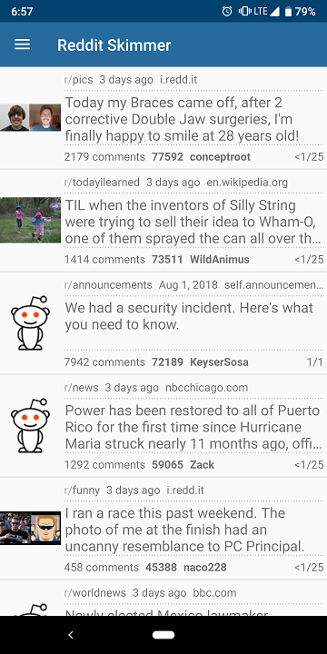
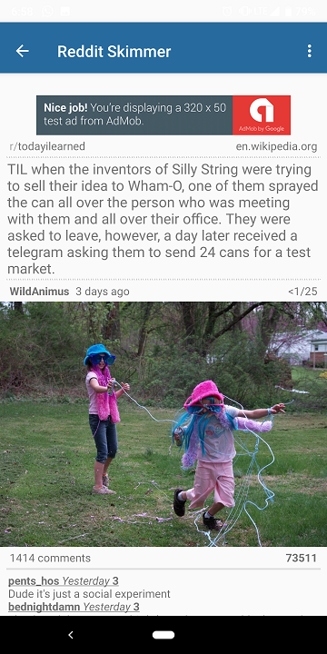
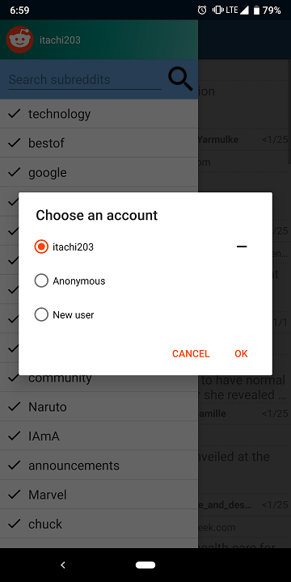

# RedditSkimmer

RedditSkimmer is an app that allows Reddit users to keep track of all of their subscribed subreddits by displaying the top post from each subreddit.
Users can log in or use the app anonymously and can subscribe or unsubscribe from subreddits from within the app.

##### Top posts from subreddits and Post details

##### Subreddit list and Log in dialog

##### OAuth2 Login screen and Authorization

##### Widget displaying top 4 posts

